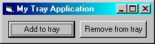



## Add your code to the system tray

### Description

Ever wonder how all of those other software programs put themselves in the system tray(The start menu icon list at the bottom of the screen)? Well, this code, centered around traymodule.bas and written entirely by me, will do just that. Just use the RespondToTray(X) function in the Form_Mousemove event and call addtotray and removefrom tray when you want to add or remove your icon from the tray. You can customize tool-tips(The yellow labels), the icon appearing in the tray, and the form to have it respond to when you click the tray. You may use this module in any program you'd like, although if you're going to post a program using this on PSC, please give me credit for the module.
 
### More Info
 
Make sure you remove the icon from the tray in the Form_Unload event, or it will stay there for about 30 seconds

             |
---                |---
**Submitted On**   |2000-04-21 19:00:08
**By**             |[Michael Barnathan](https://github.com/Planet-Source-Code/PSCIndex/blob/master/ByAuthor/michael-barnathan.md)
**Level**          |Intermediate
**User Rating**    |4.9 (97 globes from 20 users)
**Compatibility**  |VB 4\.0 \(32\-bit\), VB 5\.0, VB 6\.0
**Category**       |[Miscellaneous](https://github.com/Planet-Source-Code/PSCIndex/blob/master/ByCategory/miscellaneous__1-1.md)
**World**          |[Visual Basic](https://github.com/Planet-Source-Code/PSCIndex/blob/master/ByWorld/visual-basic.md)
**Archive File**   |[CODE\_UPLOAD50484212000\.zip](https://github.com/Planet-Source-Code/michael-barnathan-add-your-code-to-the-system-tray__1-7469/archive/master.zip)

